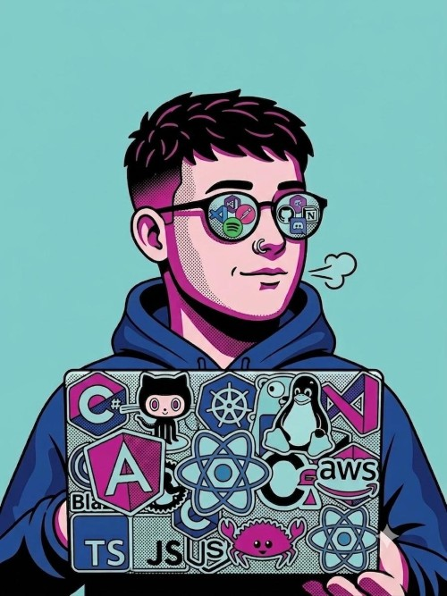

## 🎯 About Me

<table>
<tr>

<td width="58%" valign="top">

<pre><code>
const juanBello = {
    role: "Full Stack Developer | AI Enthusiast",
    location: "Bogotá, Colombia 🇨🇴",
    experience: "3+ years",

    building: [
        "Web Applications",
        "Scalable APIs",
        "AI-powered Solutions"
    ],

    learning: [
        "Artificial Intelligence",
        "Claude & LLMs",
        "Cloud Architecture",
        "System Design",
        "Advanced .NET"
    ],

    tech: {
        frontend: [
            "Angular",
            "React",
            "Next.js",
            "TypeScript",
            "HTML",
            "CSS",
            "Tailwind"
        ],

        backend: [
            "C#",
            ".NET",
            "Node.js",
            "Express",
            "Java",
            "Spring Boot"
        ],

        ai: [
            "Python",
            "TensorFlow",
            "Scikit-learn",
            "Claude",
            "LLMs"
        ],

        database: [
            "SQL Server",
            "MySQL",
            "PostgreSQL",
            "ClickHouse",
            "MongoDB"
        ],

        cloud: ["AWS"],
        os: ["Linux", "Windows"]
    },

    softSkills: [
        "Team Player 🤝",
        "Problem Solver 💡",
        "Continuous Learner 📚",
        "Agile Methodologies 🔄"
    ]
};
</code></pre>

 

</td>

<td width="42%" align="center" valign="middle">

</td>

</tr>
</table>